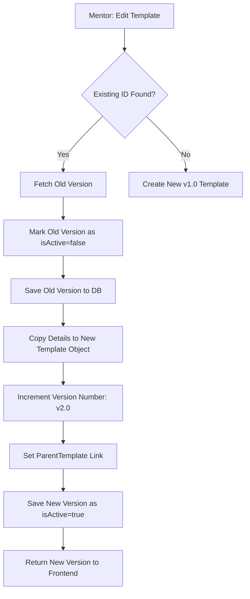

# 🏛️ Digital Consent Portal (DCP)

A modern, role-based Digital Consent Platform designed for secure template management, immutable form versioning, and blockchain-inspired signature integrity.


---

## 🛠️ Tech Stack

### 🚀 Backend
- **Framework**: Spring Boot 3.2.4
- **Language**: Java 24 (Compatible with JDK 17+)
- **Database**: PostgreSQL (Local)
- **Security**: Spring Security + JWT (Stateless Authentication)
- **Object Mapping**: Hibernate / JPA
- **Build Tool**: Maven (mvnw)

### 🎨 Frontend
- **Framework**: React 18 (Vite)
- **Styling**: Tailwind CSS v4 (Glassmorphism UI)
- **Navigation**: React Router DOM v6
- **Icons**: Lucide-React
- **State Management**: React Context API
- **HTTP Client**: Axios

---

## ✨ Key Features

### 🔐 Role-Based Access Control (RBAC)
- **Admin**: Macro visibility—Global Audit Trails and User Management.
- **Mentor**: Focuses on "Creation"—Template Editor and Student Assignment grid.
- **Student**: Focuses on "Action"—A clean list of pending and signed documents.

### 📜 Immutable Form Versioning
The core of DCP is its **Immutable Versioning Engine**. Instead of updating existing text, every edit creates a new "Leaf" in the template tree, ensuring that student signatures remain mathematically linked to the *exact* text they signed.

### 💎 Premium UI/UX
- **Glassmorphism Aesthetic**: Modern, translucent UI components.
- **Micro-animations**: Custom `reveal`, `pulse-glow`, and `float` animations.
- **Responsive Design**: Seamless experience across devices.

---

## 📂 Project Structure

```text
/Consent-Web-App
│
├── /backend                    # Spring Boot Application
│   ├── /src/main/java          # Source Code (Controller, Service, Repository, Entity, Security, DTO)
│   └── /src/main/resources     # application.yml config
│
├── /frontend                   # React Application
│   ├── /src/pages              # UI Components (Admin, Mentor, Student)
│   ├── /src/context            # AuthContext (Role management)
│   └── index.css               # Global Theme & Animations
│
├── Architecture diagram.png    # High-level system flow
└── ER Diagram.png              # Database Relationship Schema
```

---

## ⚡ Quick Start

### 1️⃣ Database Setup
Ensure a PostgreSQL instance is running on `localhost:5432`. Create the database:
```powershell
# Default password for 'postgres' user: 9284
$env:PGPASSWORD = "9284"
createdb -U postgres consentdb
```

### 2️⃣ Run Backend
```powershell
cd backend
$env:JAVA_HOME = "C:\Program Files\Java\jdk-24" # Path to your JDK
.\mvnw.cmd spring-boot:run
```
*Backend available at: `http://localhost:8080`*

### 3️⃣ Run Frontend
```powershell
cd frontend
npm install
npm run dev
```
*Frontend available at: `http://localhost:5173`*

---

## 🏗️ Architecture Flow



---

## 📝 Roadmap
- [ ] **Document Export**: Ability to download signed forms as PDFs.
- [ ] **Email Notifications**: Notify students when a new form is published.
- [ ] **Real-time Updates**: WebSockets for live audit logs.
- [ ] **Advanced Signature**: Physical signature pad for mobile.

---

## 🛡️ License
Internal Project - Digital Consent App
