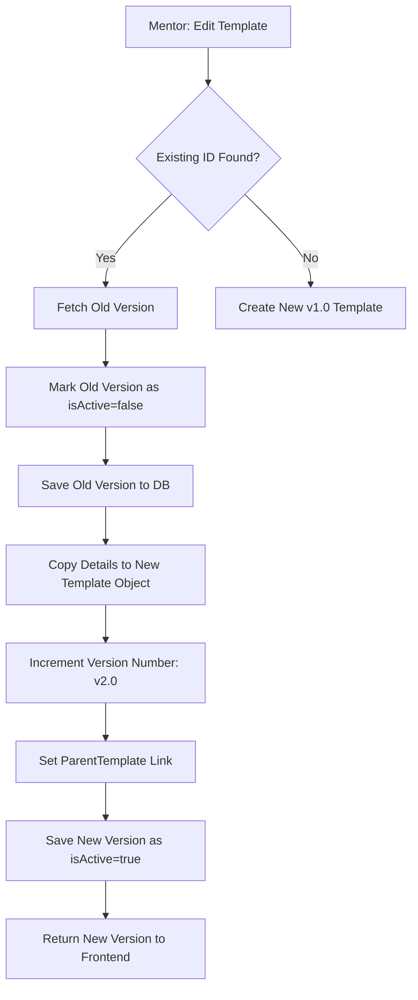

# Digital Consent Portal (DCP)

A modern, role-based Digital Consent Platform designed for secure template management, immutable form versioning, and blockchain-inspired signature integrity.

## 🚀 Phase 1: Planning & Architecture

### Tech Stack Justification
We selected the **Spring Boot + React + PostgreSQL** stack for the following reasons:
- **Robust Security**: Spring Security provides enterprise-grade JWT implementation for stateless authentication (Phase 2 requirement).
- **Data Integrity**: PostgreSQL's relational model is ideal for handling the hierarchical relationships between Mentors and Students, as well as the versioned consent templates.
- **Modern UX**: React with Tailwind CSS (v4) allows for a high-fidelity "Glassmorphism" UI with smooth animations (Phase 3 requirement).

### System Flow: Form Versioning Engine
The core of DCP is its **Immutable Versioning Engine**. Instead of updating existing text, every edit creates a new "Leaf" in the template tree, ensuring that student signatures remain mathematically linked to the *exact* text they signed.



### DB Schema & Entity Design
The database (ER Diagram available in root) follows a strictly relational model:
- **User**: Handles Auth and the hierarchical Student-Mentor many-to-one relationship.
- **ConsentTemplate**: Implements recursive parenting for version tracking.
- **ConsentRecord**: Bridges users to specific *versions* of templates with cryptographic signature hashes.

### UI/UX Wireframes
Our user journey is mapped across three distinct dashboards:
1. **Admin**: Focuses on "Macro" visibility—Global Audit Trails and User Management.
2. **Mentor**: Focuses on "Creation"—The Template Editor and Student Assignment grid.
3. **Student**: Focuses on "Action"—A clean list of pending and signed documents.

---

## 🛠 Phase 2: API & Integration

### RESTful Design
Our APIs follow standard REST conventions:
- `POST /api/auth/register`: Role-based registration.
- `GET /api/templates`: Fetches active/assigned forms (Filterable).
- `PUT /api/templates/{id}`: Triggers the versioning engine.
- `POST /api/consents/{id}/sign`: Generates a unique signature hash.

### Installation & Local Setup
1. **Database**: Create a PostgreSQL DB named `consentdb`.
2. **Backend**:
   ```powershell
   cd backend
   .\mvnw.cmd spring-boot:run
   ```
3. **Frontend**:
   ```powershell
   cd frontend
   npm install
   npm run dev
   ```

---

## 🛡 Phase 3: Advanced Logic & Refinement

### Branching Strategy
We adhere to a **Git Flow** strategy to ensure deployment stability:
- `main`: Production-ready code only.
- `develop`: Integration branch for new features.
- `feature/*`: Short-lived branches for specific rubrics (e.g., `feature/pagination`).

### Advanced Features
- **Pagination**: Supports high-volume records for Admin audits.
- **Search & Filter**: Real-time frontend matching using React hooks.
- **Toasts**: Real-time feedback via `react-hot-toast`.

---

## 🛡 License
Internal Project - Digital Consent App
